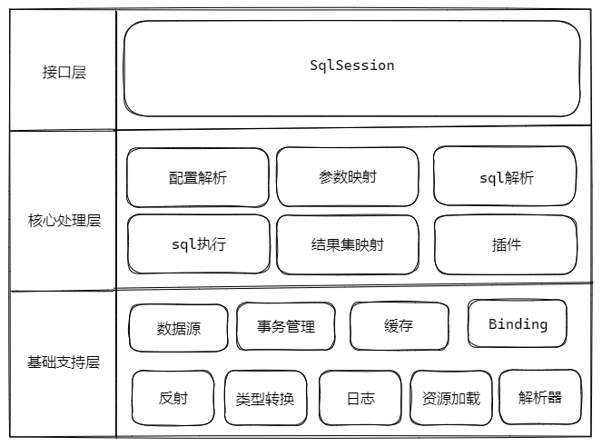

MyBatis 3.4.2 源码学习
=====================================

# 整体架构

## 基础支持层
### 1. 解析器
org.apache.ibatis.parsing

使用XPath（XPathParser）进行xml解析，GenericTokenParser解析${} 格式的字符

### 2. 日志
org.apache.ibatis.logging  
Log、LogFactory使用适配器模式，通过jdk动态代理的方式，将jdbc操作通过指定的日志框架打印出来

### 3. 反射
org.apache.ibatis.reflection  
Reflector

### 4. 缓存
org.apache.ibatis.cache  
Cache接口定义了缓存的基本行为，使用装饰器模式，
impl下的 PerpetualCache 存储的是一级缓存

#### 一级缓存

在 BaseExecutor.query() 方法中，会根据 `<select>` 标签的 flushCache 和 Configuration 的 localCacheScope 决定是否清空一级缓存；
在update() 方法中，负责执行 insert、update、delete这三类语句也会清空缓存。

#### 二级缓存

1. mybatis-config.xml <settings>中配置 cacheEnabled，默认值为true
2. mapper.xml 中配置了 <cache> 节点会根据 namespace 创建相应的Cache对象，<cache-ref namespace=""> 节点不会创建独立的 Cache对象，它和指定的 namespace共享同一个。
3. `<select>` 节点中的 useCache属性，查询的结果会保存到二级缓存中。useCache默认值为true。

### 5. 类型转换
org.apache.ibatis.type  
TypeHandler、TypeHandlerRegistry 实现 java 和 jdbc 类型的转换

### 6、 io
org.apache.ibatis.io  
通过 VFS 扫描资源

### 7. 数据源
org.apache.ibatis.datasource  
DataSourceFactory工厂接口，两类DataSource：PooledDataSource（有缓存）、UnPooledDataSource

### 8. 事务
org.apache.ibatis.transaction  
TransactionFactory

### 9. binding
org.apache.ibatis.binding  
保存mapper信息

## 核心处理层

### 1. 配置解析
org.apache.ibatis.builder.xml  
XMLConfigBuilder、XMLMapperBuilder等

### 2. 参数映射
org.apache.ibatis.executor.parameter  
ParameterHandler

### 3. sql解析
org.apache.ibatis.mapping  
SqlSource

### 4. sql执行
org.apache.ibatis.executor.BaseExecutor  
org.apache.ibatis.executor.statement  
StatementHandler

### 5. 结果集映射
org.apache.ibatis.executor.resultSet  
ResultSetHandler

### 6. 插件
org.apache.ibatis.executor.plugin  

## 接口层
> SqlSession

org.apache.ibatis.session  
SqlSessionFactory

阅读资料
----------

- [【mybatis技术内幕】](https://book.douban.com/subject/27087564/)
- [tuguangquan mybatis](https://github.com/tuguangquan/mybatis)
